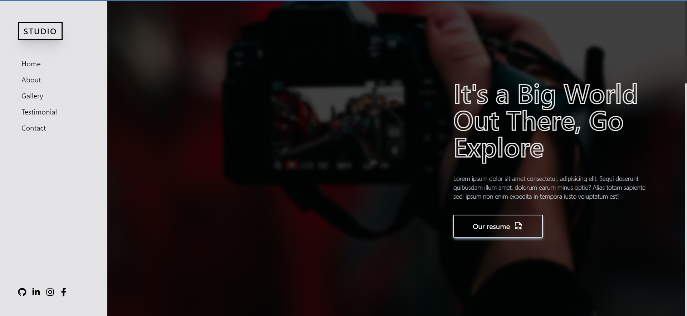

<h1 align="center">
  📸📝 Studio SPA 
</h1>

<h4 align="center"><a href="https://studio-spa-portfolio.vercel.app/">Clique para visitar o projeto</a></h4>

---

## 💼 Tecnologias utilizadas

Para o desenvolvimento deste site utilizei as seguintes tecnologias:
- React.js
- Vite
- Tailwindcss
- Phosphor Icons
- React Icons

---

<h2>👨‍🚀 Autor</h2>

<table>
  <tr>
    <td>
      <a href="https://github.com/manuelbento19">
         
        
          <b>Manuel Bento</b>
        
      </a>
    </td>
  </tr>
</table>